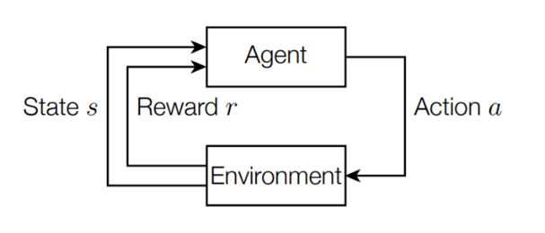
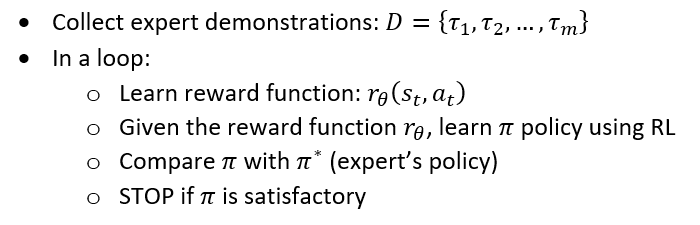
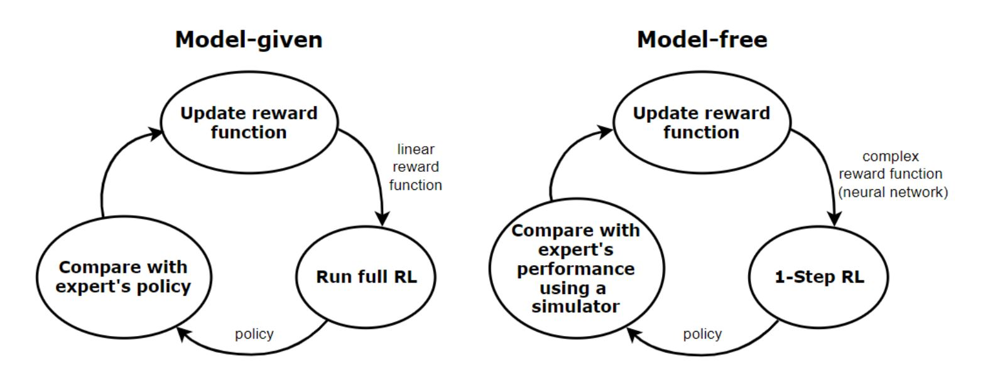
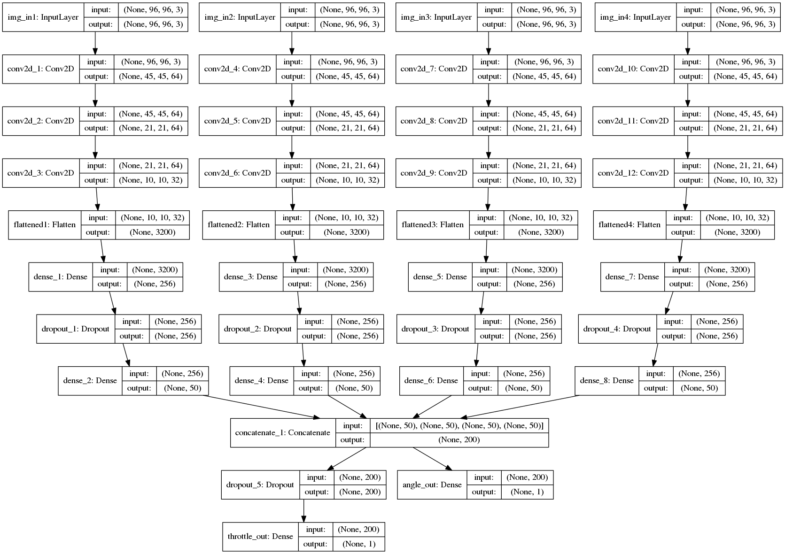

# ImitationLearning(IL) using OpenAI-gym
## Agent interaction with Environment
<p align="center">
  
</p>

Where,

i. Agent – the program controlling the object of concern (for instance, a robot).

ii. Environment – this defines the outside world programmatically. Everything the agent(s) interacts with is part of the environment. It’s built for the agent to make it seem like a real-world case. It’s needed to prove the performance of an agent, meaning if it will do well once implemented in a real-world application.

iii. Rewards – this gives us a score of how the algorithm performs with respect to the environment. It’s represented as 1 or 0. ‘1’ means that the policy network made the right move, ‘0’ means wrong move. In other words, rewards represent gains and losses.

iv. Policy – the algorithm used by the agent to decide its actions. This is the part that can be model-based or model-free.

## Basic of Reinforcement Learning
Reinforcement learning (RL) is the part of machine learning, where an agent interacts with an environment by following a policy. In each state of the environment, it takes action based on the policy, and as a result, receives a reward and transitions to a new state. The goal of RL is to learn an optimal policy which maximizes the long-term cumulative rewards.
To overcome the sparse reward problem associated with RL, imitation learning (IL) can be applied. In IL instead of trying to learn from the sparse rewards or manually specifying a reward function, an expert (typically a human) provides us with a set of demonstrations. The agent then tries to learn the optimal policy by following, imitating the expert’s decisions.

## Basic of Imitation Learnig
Generally, imitation learning is useful when it is easier for an expert to demonstrate the desired behaviour rather than to specify a reward function which would generate the same behaviour or to directly learn the policy. The main component of IL is the environment, which is essentially a Markov Decision Process (MDP). This means that the environment has an S set of states, an A set of actions, a P(s’|s,a) transition model (which is the probability that an action a in the state s leads to state s’ ) and an unknown R(s,a) reward function. The agent performs different actions in this environment based on its π policy. Finally, the loss function and the learning algorithm are two main components.

## Inverse Reinforcement Learning
Inverse reinforcement learning (IRL) is a different approach of imitation learning, where the main idea is to learn the reward function of the environment based on the expert’s demonstrations, and then find the optimal policy (the one that maximizes this reward function) using reinforcement learning. In this approach:
We start with a set of expert’s demonstrations (we assume these are optimal) and then we try to estimate the parameterized reward function, that would cause the expert’s behaviour/policy.
We repeat the following process until we find a good enough policy:
We update the reward function parameters.
Then we solve the reinforced learning problem (given the reward function, we try to find the optimal policy).
Finally, we compare the newly learned policy with the expert’s policy.
The general IRL algorithm is the following:
<p align="center">
  
</p>

Depending on the actual problem, there can be two main approaches of IRL: the model-given and the model-free approach. The IRL algorithm of these approaches is different, which is demonstrated in the picture below.
<p align="center">
  
</p>

## Approach
The model-free approach is a more general case. Here, we assume that the reward function is more complex, which we usually mod
el with a neural network. We also suppose that the state space of the MDP is large or continuous, therefore in each iteration, we only solve a single step of the RL problem. In this case, we don’t know the state transitions dynamics of the environment, but we assume, that we have access to a simulator or the environment. 

## Install dependencies
```
pip install -r requirements.txt
```

## Generate synthetic expert data
   a. Create env
   ```
   env = gym.make('carracing-v0')
   ```
   b. Data_Generate.py: Plays open AI gym CarRacing-v0 and record data(stores observations and actions) for imitation learning.
   
   c. Actions
   Steering: real valued in [-1, 1] 
   Gas(Throttle): real valued in [0, 1]
   Brake: real valued in [0, 1]
   
   d. Observations
   RGB Image : STATE_W = 96 * STATE_H = 96 * 3
   
   
   e. Reward: 
    -0.1 every frame and +1000/N for every track tile visited, where N is the 
    total number of tiles in track. For example, if you have finished in 732 frames, your
    reward is 1000 - 0.1*732 = 926.8.  
   
## Training

 a. Load the saved data recorded during running Data_Generate.py
 
 ```
 Load_and_Wrangle()
 ```  
    
 b. Set the hyper parameters 
  ```
StopLoss = 1.4
BatchSize = 100
Epochs = 10
dropout = 0.2
dropout_thr = 0.6
optim = 'rmsprop'
LossWeights = [0.9, 0.004]
```

 c. Create the model
 
 A network structure of four one input Convolutional Neural Network is used as follows:
 ```
 build_model_Parallel(input_dim=(96, 96, 1))
 ```
 
 <p align="center">
  
</p>

d. Fit the model on data

 ```
 Build_Fit_Model(X, Y1, Y2)
 ```
e. Loss function

   Mean square error (MSE)
   ```
   model.compile(optimizer=optim,
                  loss={'angle_out': 'mean_squared_error', 
                        'throttle_out': 'mean_squared_error'},
                  loss_weights={'angle_out': LossWeights[0], 'throttle_out': LossWeights[1]})
 ```
